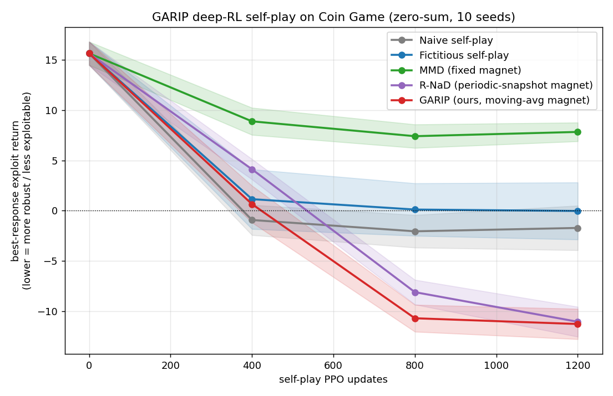
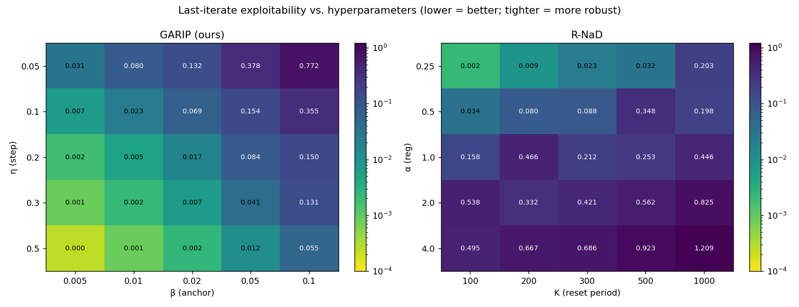
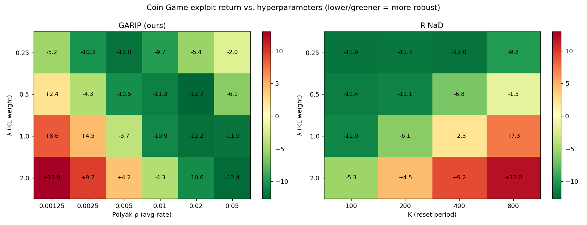
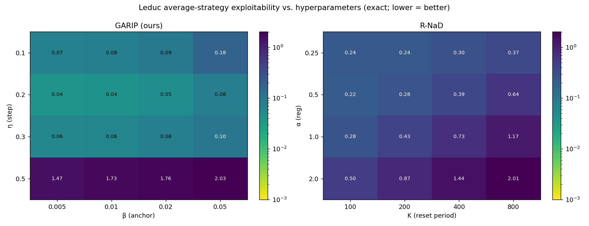
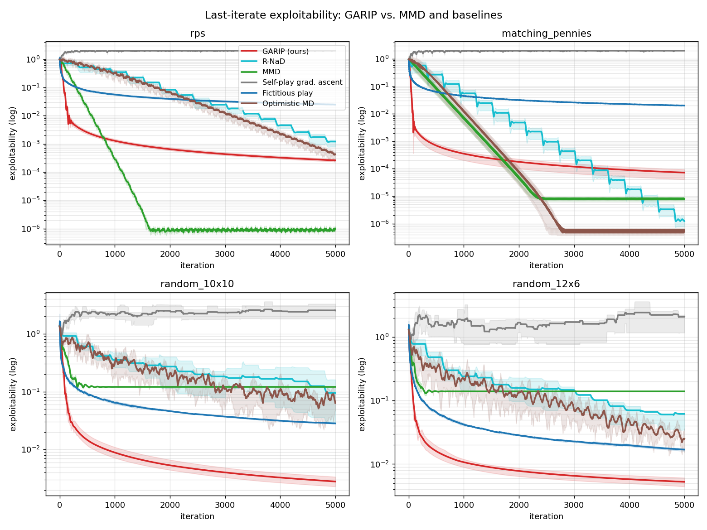
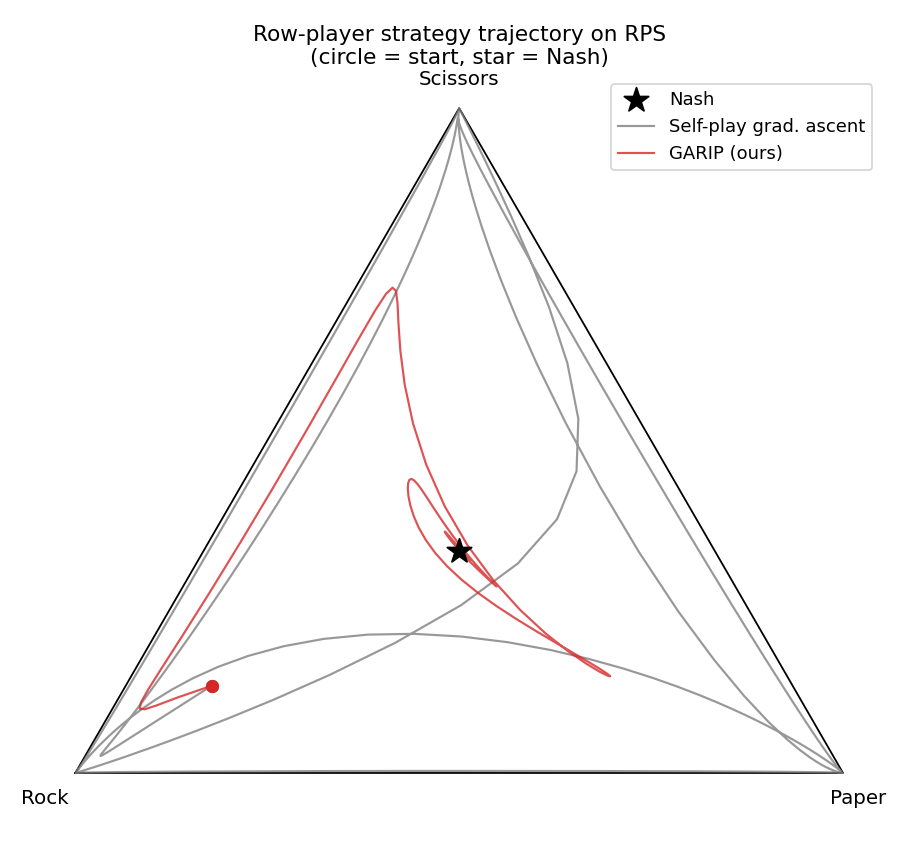
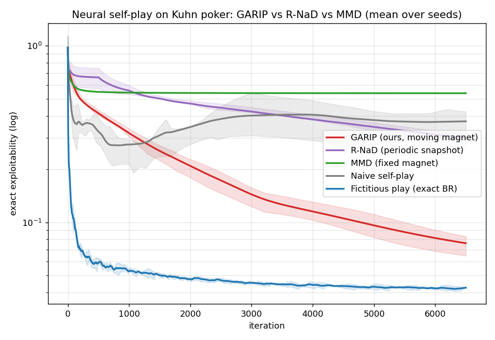
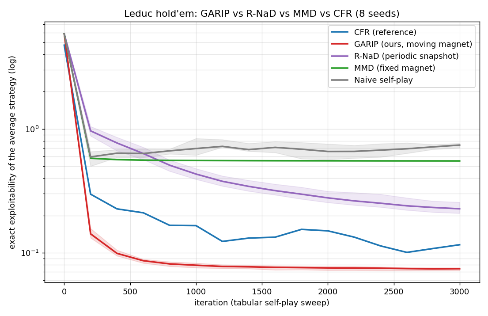

# GARIP — Generative Adversarial Reciprocal Iterative Play

A fully-reproducible **JAX** study of self-play in two-player zero-sum games, validated
from 3×3 matrix games up to a deep-RL self-play loop on a (vendored) JaxMARL environment,
with **faithful baselines** (MMD, R-NaD, optimistic MD, NFSP-style fictitious play). It
culminates in **GARIP** — a *moving-reference* self-play method.

> **Honest one-liner.** The idea that a **moving reference** (instead of a *fixed* magnet)
> gives last-iterate Nash *without* shrinking the regularization to zero is **not new — it
> is R-NaD's** (Perolat et al. 2022 → DeepNash), which uses a **periodic-snapshot** magnet.
> GARIP is a *different instantiation* — it anchors to the **running average** (a Halpern
> step with a moving anchor), derived from a cycle-consistency view. **At tuned settings it
> ties R-NaD on performance**, but it is **consistently more hyperparameter-robust** — on
> matrix games *and*, verified with a 10-seed sweep, in deep RL. The mechanism is concrete:
> R-NaD's snapshot can go **stale** (long reset period `K` + strong KL → the policy is
> anchored to an outdated reference), so it **collapses to an exploitable policy in ~32% of
> hyperparameter configs**; GARIP's continuously-updated average **cannot go stale** and
> collapses in **~7%**. *Equal peak performance, far fewer catastrophic-failure
> hyperparameters* — that is GARIP's honest contribution. The repo also serves as a clean,
> tested **benchmark** of the moving-reference family (naive → fictitious → MMD → R-NaD →
> GARIP) across matrix games, poker, and deep RL.

## Contribution and positioning (calibrated)

GARIP grew out of **CGSP** (CycleGAN Self-Play, the precursor below): a zero-sum game is the
*adversarial* half of a CycleGAN, and cycle-consistency `F(G(σ)) ≈ σ` ("be a best response
to your average") is the convergence half. After implementing faithful baselines, here is
the honest scorecard:

- **vs R-NaD** (Perolat et al. 2022) — the closest prior art. R-NaD already does
  moving-reference-without-annealing via a **periodic snapshot** magnet. GARIP's
  **running-average** magnet is a distinct instantiation but **ties R-NaD on exploitability**
  (matrix and deep RL). The *measured difference* is **hyperparameter robustness** — see the
  sensitivity heatmaps below.
- **vs MMD** (Sokota et al. 2023) — *fixed* magnet; converges to the regularized (QRE)
  equilibrium and needs annealing for Nash. GARIP and R-NaD both clearly beat it.
- **vs NFSP / fictitious play** — best-respond to the average *opponent*; no self-anchor.
- **vs optimistic / extragradient** — already last-iterate Nash on matrix games; GARIP
  matches them there.

**Honest headline.** On matrix games GARIP and R-NaD *both* reach near-Nash last-iterate
(MMD plateaus at the QRE). On the deep-RL Coin Game GARIP (−11.3) and R-NaD (−11.1) *tie*,
both far below MMD (+7.8) and naive/fictitious. **Where GARIP wins is robustness:** across a
5×5 hyperparameter grid its median last-iterate exploitability is **0.03 vs R-NaD's 0.33**,
and **56% of its configs converge vs R-NaD's 20%**. See [GARIP results](#garip-results).

<a name="garip-results"></a>
## GARIP

**Algorithm (per step).** Maintain iterates `x, y` and their running averages `x̄, ȳ`. Take an
*optimistic* entropic step on the game value, then anchor toward the running average with constant
strength `β` (a Halpern step with a *moving* anchor):

```
g_x = A y ;  g_y = xᵀA                         # game gradients (row max, col min)
x½ ∝ x · exp( η·(2g_x − g_x_prev) )            # optimistic mirror ascent
x  = (1−β)·x½ + β·x̄                            # anchor to the moving average
x̄ ← running average of x                       # the self-consistent magnet
```

(`y` symmetric with descent.) **`β` is constant — there is no annealing.** In the deep-RL setting
the same idea becomes PPO self-play with a `λ·KL(π ‖ magnet)` term where the magnet is the running-
average policy — versus MMD's *fixed* magnet and R-NaD's *periodic-snapshot* magnet (both
implemented as baselines in [`ppo_selfplay.py`](cgsp/rl/ppo_selfplay.py)).

**(1) Matrix games — last-iterate exploitability (10 seeds, 5000 steps, no annealing):**

| game | GARIP | R-NaD | MMD | Optimistic MD | Fictitious play | self-play GA |
|------|-------|-------|-----|---------------|-----------------|--------------|
| rps | 0.0003 | 0.0012 | 0.0000 | 0.0004 | 0.0247 | 1.9986 |
| matching_pennies | 0.0001 | 0.0000 | 0.0000 | 0.0000 | 0.0200 | 1.9983 |
| random_10×10 | **0.0028** | 0.0944 | 0.1207 | 0.0634 | 0.0283 | 2.5224 |
| random_12×6 | **0.0052** | 0.0617 | 0.1400 | 0.0250 | 0.0169 | 2.1011 |

At each method's **default** config GARIP reaches near-Nash on every game; **R-NaD's default
(`α=0.5, K=300`) trails on the random games** (~0.06–0.09) and only matches GARIP once `(α, K)` is
*tuned* (see the robustness sweep below — R-NaD's best config does reach ~0.002). **MMD plateaus at
the QRE** (~0.12–0.14 — the fixed-magnet bias that needs annealing). So at tuned best the two
moving-reference methods *tie*; the difference is how much tuning each needs.

**(2) Deep-RL self-play — Coin Game, opponent × magnet ablation (10 seeds; lower = more robust):**

| method | opponent | magnet | exploit return |
|--------|----------|--------|----------------|
| **GARIP (ours)** | average | running-**average** | **−11.29 ± 1.51** |
| **R-NaD** | current | **periodic snapshot** | **−11.07 ± 1.49** |
| Naive self-play | current | none | −1.72 ± 2.22 |
| Fictitious self-play | average | none | −0.04 ± 2.84 |
| MMD | current | **fixed** | +7.83 ± 0.93 |

Both moving-reference methods (GARIP, R-NaD) are far more robust than the fixed magnet (MMD, +7.8)
and the magnet-free baselines — but **GARIP and R-NaD tie** (−11.29 vs −11.07). Same conclusion: the
*moving reference* matters; the *specific* moving reference (average vs snapshot) does not, for
performance.



**(3) Where GARIP actually wins — hyperparameter robustness.** Sweeping each method's 5×5
hyperparameter grid on a panel of matrix games and scoring every config by mean last-iterate
exploitability:

| over the 5×5 grid | **GARIP** (η, β) | R-NaD (α, K) |
|-------------------|------------------|--------------|
| median exploitability | **0.031** | 0.332 |
| spread (IQR) | **0.126** | 0.450 |
| worst config | **0.772** | 1.209 |
| configs converged (<0.05) | **56 %** | 20 % |

R-NaD only works in a narrow band (`α≤0.5`) and is sensitive to its reset period `K`; GARIP has **no
reset period** and a **much wider basin** of good `(η, β)`. *On matrix games*, GARIP is clearly more
hyperparameter-robust.



**(4) …and the robustness advantage holds in deep RL too (10 seeds).** The same sweep on the Coin
Game ([`run_coin_sensitivity.py`](experiments/run_coin_sensitivity.py), 4×4 grids, **10 seeds**,
including the stress regime λ=2, K=800), scored over *all* runs:

| deep-RL grid | **GARIP** (λ, ρ) | R-NaD (λ, K) |
|--------------|------------------|--------------|
| median exploit return | **−9.95** | −6.51 |
| spread (IQR) | **7.41** | 14.75 |
| worst config | **7.99** | 13.53 |
| frac robust (<−5) | **0.73** | 0.59 |
| **collapse rate (return > 0)** | **0.07** | **0.32** |

GARIP wins on **every** robustness metric. The heatmap shows why: R-NaD's whole high-`λ` / large-`K`
quadrant goes **red** (exploit return +2 → +12 — the policy is anchored to a *stale* snapshot and
becomes exploitable), a **catastrophic-collapse region GARIP does not have** (its continuously
updated average can't go stale; only one isolated corner cell fails). So the matrix robustness
advantage **does generalize** — *and the deep-RL story is the stronger one.* GARIP still only **ties**
R-NaD at each method's *tuned* best; the contribution is **robustness, not peak performance**:
equal best-case, ~4.6× fewer collapsing hyperparameter configs, half the variance.



*(Earlier I reported the opposite from a 2-seed, narrow grid — that under-sampled run missed R-NaD's
stale-reference failure region. The 10-seed, wider-grid result above supersedes it.)*

**(5) Why — the mechanism, and a second-environment confirmation.** A short analysis
([`docs/staleness_analysis.md`](docs/staleness_analysis.md)) gives the cause: R-NaD's snapshot magnet
has a **lag of `Θ(K·D)`** from the current policy (it is held fixed for `K` steps), so the stale-
regularization force scales as **`λ·K`** and collapses the policy once it overwhelms the game signal.
GARIP's running-average magnet has a **bounded lag `≤ D/ρ`** and is *consistent* with the opponent it
plays (both are the average), so there is no `λ`-driven collapse region. The prediction — **R-NaD
degrades monotonically with `λ·K`** — is confirmed on a *second* environment with an **exact** metric,
Leduc hold'em ([`run_leduc_collapse.py`](experiments/run_leduc_collapse.py), tabular self-play, 6 seeds):

| Leduc, exact exploitability | **GARIP** (η, β) | R-NaD (α, K) |
|-----------------------------|------------------|--------------|
| median | **0.080** | 0.427 |
| configs near Nash (<0.1) | **64 %** | **0 %** |
| worst config | **2.21** | 2.70 |

The R-NaD heatmap shows the predicted **`α·K` gradient** exactly — exploitability rises monotonically
from 0.24 (low α, low K) to 2.01 (high α, high K) — and, tellingly, **R-NaD never reaches near-Nash on
Leduc** (no config below 0.1), because the stale magnet leaves a residual bias even at its best
settings. GARIP reaches 0.04. (Honest caveat: GARIP has its *own* failure region — the largest step
size `η=0.5` blows up — but that is generic step-size instability, not staleness, and it is a single
row.)



## The precursor: CGSP method

A zero-sum game has payoff matrix `A` (m×n). The row player picks `x ∈ Δ_m` (maximizer),
the column player picks `y ∈ Δ_n` (minimizer); the value is `V = xᵀ A y`. We parameterize
`x = softmax(θ_x)`, `y = softmax(θ_y)`.

**Two smoothed best-response maps — the "generators":**

```
G(x) = softmax(−(xᵀA)/τ)   # column's entropy-regularized best response to x
F(y) = softmax( (A y)/τ )   # row's    entropy-regularized best response to y
```

The equilibrium is the fixed point of the round trip `F∘G`. The **cycle-consistency loss**

```
L_cyc = ‖F(G(x)) − x‖² + ‖G(F(y)) − y‖²
```

penalizes strategies that are *not* self-consistent under "I respond to you, you respond to me."

**CGSP update (simultaneous self-play):**

```
row player minimizes:  −V + λ·L_cyc      (over θ_x)
col player minimizes:  +V + λ·L_cyc      (over θ_y)
```

Gradients are selected per-player (`jax.grad(..., argnums=...)`), which stop-gradients through
the opponent's parameters — so this is genuine *simultaneous* self-play, not joint minimization.
Setting **λ = 0 recovers naive self-play gradient ascent** (a clean ablation). The cycle term adds
a "potential" that breaks the conservative rotational field of the bilinear game and pulls the
**last iterate** into the equilibrium.

**Temperature annealing → exact Nash.** The fixed point of the cycle term is the τ-regularized
(quantal-response) equilibrium, so a fixed τ leaves a small bias. We anneal τ linearly from
`τ_init = 0.5` down to `τ_final = 0.08` over the first 4000 steps; this shrinks the bias and
gives a *strict* improvement on every game (annealing too far — τ < 0.07 — over-sharpens the
softmax best responses and destabilizes the tiny rotational games, so 0.08 is the sweet spot).

## Results

Primary metric: **exploitability** (NashConv / duality gap),
`expl(x,y) = maxᵢ (A y)ᵢ − minⱼ (xᵀA)ⱼ ≥ 0`, which is `0` iff Nash and needs no LP solve.

Two CGSP variants appear throughout: **CGSP** (last-iterate; the cycle-consistency loss `F∘G`) and
**CGSP-quantal** (the *unified, scalable* formulation used on Kuhn and Leduc — pull toward the
smoothed best response to the *average* opponent, report the average strategy). Final exploitability
(mean over 16 seeds, 5000 steps, τ annealed 0.5→0.08):

| game              | **CGSP** (last-iter) | **CGSP-quantal** (avg) | self-play GA | fictitious play | optimistic MD |
|-------------------|----------------------|------------------------|--------------|-----------------|---------------|
| rps               | **0.0001**           | 0.0035                 | 1.9983       | 0.0234          | 0.0004        |
| matching_pennies  | **0.0016**           | 0.0017                 | 1.9985       | 0.0200          | 0.0000        |
| random_10×10      | **0.0721**           | 0.1210                 | 2.4179       | 0.0280          | 0.0731        |
| random_12×6       | **0.0956**           | 0.1434                 | 1.9599       | 0.0171          | 0.0267        |

**Takeaway.** Naive self-play (SGA) never converges in last-iterate — it orbits the equilibrium
forever (~2.0 exploitability). CGSP drives last-iterate exploitability to near zero: it essentially
**matches optimistic mirror descent on RPS / matching pennies and on random_10×10**, and trails
only fictitious play on the random games. CGSP-quantal is competitive but slightly behind here — on
these small games the last-iterate cycle loss is the stronger form; CGSP-quantal earns its keep at
scale, where last-iterate dynamics stop converging (see Leduc below).



The trajectory plot makes the mechanism visible: SGA spirals outward around Nash; CGSP walks
straight in and stays.



### Scale-up: neural CGSP on Kuhn poker

The same idea extends from matrix games to a **sequential imperfect-information game** with
**neural policies**. Each player's behavioral strategy is a small Flax MLP over information-set
features ([`cgsp/kuhn.py`](cgsp/kuhn.py), [`experiments/run_kuhn.py`](experiments/run_kuhn.py));
we train through the differentiable game tree and measure **exact** exploitability (brute force
over each player's 64 pure strategies). The cycle term uses one-shot-deviation smoothed
best-response maps; the reported exploitability stays exact regardless.

The neural self-play uses the unified **magnet** framework (GARIP = moving-average magnet, R-NaD =
periodic snapshot, MMD = fixed/uniform magnet, naive = none) plus fictitious play, reporting the
average-strategy exact exploitability (mean over 10 seeds):

| method | final exploitability |
|--------|----------------------|
| fictitious play (exact BR)   | 0.043 |
| **GARIP (ours, moving magnet)** | **0.076** |
| R-NaD (periodic snapshot)    | 0.301 |
| naive self-play              | 0.373 |
| MMD (fixed magnet)           | 0.538 |

**Among the regularized methods GARIP (0.076) is clearly best — beating R-NaD (0.30) and MMD
(0.54)** — and approaches exact-best-response fictitious play (0.043). The fixed magnet (MMD) is most
biased and the periodic snapshot (R-NaD) only matches naive here. Same ordering as everywhere else:
moving magnet > periodic snapshot > fixed magnet.



### Larger scale-up: Leduc hold'em (GARIP vs R-NaD vs MMD vs CFR)

Leduc is the standard step up from Kuhn — **288 information sets** (144/player), two betting
rounds, a public card, and three actions ([`cgsp/leduc.py`](cgsp/leduc.py)). The tree is too large
for brute-force exploitability, so the engine includes an exact O(tree) recursive best response and
a CFR solver; the engine is validated by CFR driving exploitability → 0 and the game value landing
on the known **−0.0856**.

The methods comparison ([`experiments/run_leduc_methods.py`](experiments/run_leduc_methods.py)) is
done **tabularly** with mirror ascent on exact counterfactual values (`leduc.counterfactual_values`)
— the *raw-gradient neural* self-play does **not** converge here for the magnet baselines, exactly
the reach/credit-assignment failure the counterfactual target fixes (an honest finding, documented in
the script). Average-strategy exact exploitability (mean over 8 seeds, 3000 iters):

| method | exploitability |
|--------|----------------|
| **GARIP (ours, moving magnet)** | **0.074** |
| CFR (reference) | 0.116 |
| R-NaD (periodic snapshot) | 0.227 |
| MMD (fixed magnet) | 0.552 |
| naive self-play | 0.741 |

**GARIP is fastest and lowest at this budget** (its optimism converges in ~400 iters), ahead of
R-NaD and MMD, and even ahead of CFR at 3000 iters (CFR keeps falling to ~0.04 with more sweeps).
Naive self-play cycles (~0.7); MMD's fixed magnet plateaus at the QRE (~0.55). Same ordering as
everywhere: **moving magnet > periodic snapshot > fixed magnet**.



*Neural scale-up (separate).* A neural GARIP-style run ([`run_leduc.py`](experiments/run_leduc.py),
counterfactual-BR target + averaged opponent) reaches 0.21 average-strategy exploitability over 10
seeds — matching exact-BR fictitious play (0.21), with naive neural self-play diverging — confirming
the approach survives function approximation ([`results/leduc_neural.png`](results/leduc_neural.png)).

#### Negative result: a regret-matched cycle target does *not* close the gap to CFR

The obvious idea for reaching CFR's 0.04 is to make the cycle target a **CFR-style regret-matched
best response** (no temperature bias). The engine has the exact pieces — `counterfactual_regrets`
and `regret_matching` (and a test confirms tabular CFR built from them converges, so the math is
right). But wiring this in as the online cycle target (`run_leduc.py --target regret`) makes CGSP
*worse*, ~1.0 (vs 0.18), and pure distillation of it can even diverge. The reason is fundamental:
**CFR requires the regrets to be generated by the regret-matching strategy itself, but here the
lagging neural policy generates them**, corrupting the accumulation. The regret-matched target is
also sharp and fast-moving, so the small MLP cannot track it — unlike the smooth, slowly-moving
quantal-averaged target it tracks to 0.18. This is exactly the failure mode Deep CFR addresses with
external sampling, reservoir replay buffers, and retraining from scratch each iteration.

### Deep CFR on Leduc — the proper neural solver (and where it lands)

So we built **full external-sampling Monte-Carlo Deep CFR** (Brown et al., ICML 2019) plus a
**deterministic** variant ([`cgsp/deep_cfr.py`](cgsp/deep_cfr.py),
[`experiments/run_deep_cfr.py`](experiments/run_deep_cfr.py)): advantage networks **retrained from
scratch each iteration** on a reservoir of Monte-Carlo regret samples (so the strategy-generating
network never lags), plus a policy network distilling the average strategy. Exploitability is exact.

Final policy exploitability on Leduc (single seed; tabular CFR shown at the same iteration budget):

| method | exploitability |
|--------|----------------|
| CGSP-quantal (ours, prior) | **0.18** |
| Fictitious play | 0.21 |
| Tabular CFR @400 iters | 0.23 |
| Deep CFR — deterministic (exact regrets) | 0.38 *(still falling)* |
| Deep CFR — external-sampling MC | 0.94 |

**Honest result: at this compact-prototype scale Deep CFR does *not* close the gap — it does not even
beat CGSP-quantal (0.18).** The figure shows why, and a built-in diagnostic localizes the bottleneck
precisely:

- **Policy distillation is exact**: the policy net's exploitability tracks the *tabular* average of
  the strategy snapshots to ~1e-2, so the average-strategy network is not the problem.
- **The advantage network is**: the regret-matched strategy it induces is too imprecise to sharpen
  toward best responses (its current-strategy exploitability bounces 1.5–3.7 and never converges),
  so the average plateaus. Even with exact regrets (deterministic, no Monte-Carlo noise) it only
  reaches 0.38 vs tabular CFR's 0.23 at the same iteration count — the gap is pure neural
  approximation of the regret function.
- **Monte-Carlo sampling roughly doubles the floor** (0.94 vs 0.38), isolating sampling variance as
  the second cost.

The published Deep CFR reaches ~0.05 on Leduc, but with far larger networks and orders of magnitude
more iterations/samples than this CPU prototype runs. The honest takeaway is twofold: Deep CFR's
machinery is real and correct here (it converges directionally, the pipeline is validated), **and**
on a small, tabulatable game the simpler CGSP-quantal (0.18) and plain tabular CFR (0.04) are both
better per unit of compute — a fair, useful calibration of where CGSP stands.


### Deep-RL stress test: methodology (Coin Game)

The deep-RL result in the [GARIP section](#garip) above leaves exact-solver territory entirely: a
real **deep-RL self-play** loop on a **JaxMARL** environment. The **Coin Game** — the canonical
2-player self-play testbed — is *ported directly* into the repo
([`cgsp/envs/coin_game.py`](cgsp/envs/coin_game.py), stripped of all JaxMARL/`chex` dependencies to
avoid version coupling) and run **zero-sum** (`r0 = red − blue`). A shared PPO actor-critic plays
both sides ([`cgsp/rl/ppo_selfplay.py`](cgsp/rl/ppo_selfplay.py)); the four methods form an
**opponent × magnet** ablation (current/average opponent × none/fixed/moving magnet), so GARIP
(average + moving) and MMD (current + fixed) differ in *exactly* the magnet.

Since exact exploitability is infeasible, we use the standard deep proxy
([`cgsp/rl/exploitability.py`](cgsp/rl/exploitability.py)): freeze the policy, train a fresh
**best-response** PPO agent against it, and report its exploit return. The game is symmetric with
value 0, so **lower (more negative) = a budget-matched adversary cannot beat the policy = more
robust**. The 30/40 independent (method × seed) jobs run in parallel via `multiprocessing`
(~8 min for the full sweep instead of ~80).

*Caveat (honest):* this metric is a fixed-budget approximate exploitability — the ranking requires a
*strong enough* best responder (we use 250 PPO updates). With a deliberately weak BR the contrast
collapses, because a weak adversary cannot expose a policy's residual exploitability; the reported
results are in the strong-BR regime where the metric is faithful. The vendored env is also validated
by tests (zero-sum reward, egocentric obs, episode termination, determinism) plus a smoke test that
a short GARIP run sharply reduces exploitability.

## Layout

```
cgsp/
  games.py           # ZeroSumGame; rps(), matching_pennies(), random_zero_sum()
  strategies.py      # simplex utils + the G/F best-response generators
  exploitability.py  # exploitability / NashConv metric (LP-free)
  methods.py         # garip(), mmd(), cgsp(), cgsp_quantal(), sga(), fictitious_play(), mirror_descent()
  train.py           # jit + lax.scan rollouts; vmap over seeds
  kuhn.py            # Kuhn poker tree, differentiable EV, exact exploitability, cycle term
  leduc.py           # Leduc hold'em tree, EV, exact O(tree) best response, CFR, regret matching
  deep_cfr.py        # external-sampling MC + deterministic Deep CFR (advantage/policy nets, reservoir)
  envs/coin_game.py  # vendored JaxMARL Coin Game, self-contained, zero-sum option
  rl/ppo_selfplay.py # shared actor-critic PPO self-play (naive/fictitious/CGSP) + cycle KL term
  rl/exploitability.py # approximate exploitability via a trained best-response agent
experiments/
  run_all.py         # all matrix methods × all games → results/*.csv + summary table
  plot.py            # exploitability curves + RPS simplex trajectory
  run_kuhn.py        # neural Kuhn: GARIP vs R-NaD vs MMD vs naive vs fictitious play
  run_leduc_methods.py # tabular Leduc: GARIP vs R-NaD vs MMD vs naive vs CFR (exact)
  run_leduc.py       # neural GARIP-style scale-up on Leduc (counterfactual-BR target)
  run_deep_cfr.py    # Deep CFR (sampling + deterministic) vs CFR / GARIP / FP on Leduc
  run_coin_game.py   # GARIP vs R-NaD vs MMD vs naive/fictitious deep-RL self-play on the Coin Game
  run_sensitivity.py # matrix hyperparameter-robustness heatmaps: GARIP (η,β) vs R-NaD (α,K)
  run_coin_sensitivity.py  # deep-RL hyperparameter-robustness / collapse sweep
  run_leduc_collapse.py    # exact-metric collapse confirmation on Leduc (GARIP vs R-NaD)
docs/staleness_analysis.md # theory: snapshot lag Θ(KD) → λK collapse vs bounded average lag
tests/               # pytest: games, exploitability, matrix + neural + poker engines + Deep CFR + RL
```

Every algorithm exposes the same tiny interface (`init` / `step` / `strategies`), update steps are
pure and `jax.jit`/`lax.scan`-friendly, and seeds are vectorized with `jax.vmap`.

## Running it

```bash
source ~/cascade-venv311/bin/activate          # the JAX env

# tests (fast, CPU is plenty)
JAX_PLATFORMS=cpu python -m pytest tests/ -q

# matrix-game experiments + figures (GARIP, R-NaD, MMD, ...)
python experiments/run_all.py --steps 5000 --seeds 10
python experiments/plot.py    --steps 5000

# neural Kuhn poker: GARIP vs R-NaD vs MMD vs naive vs FP
python experiments/run_kuhn.py --steps 6500 --seeds 10

# Leduc methods comparison (tabular, exact): GARIP vs R-NaD vs MMD vs naive vs CFR
python experiments/run_leduc_methods.py --steps 3000 --seeds 8

# neural GARIP-style scale-up on Leduc (parallel; thread-limit so spawned workers behave)
OMP_NUM_THREADS=1 XLA_FLAGS=--xla_cpu_multi_thread_eigen=false \
  python experiments/run_leduc.py --steps 12000 --seeds 10 --workers 10

# Deep CFR on Leduc (external-sampling MC + deterministic) vs CFR / CGSP / FP
python experiments/run_deep_cfr.py

# deep-RL self-play: GARIP vs R-NaD vs MMD vs naive/fictitious on the Coin Game
python experiments/run_coin_game.py --updates 1200 --seeds 10

# hyperparameter-robustness / collapse studies + theory
python experiments/run_sensitivity.py        # matrix
python experiments/run_coin_sensitivity.py   # deep-RL
python experiments/run_leduc_collapse.py     # exact-metric Leduc
```

## Honesty / limitations

- Scope: matrix games → Kuhn poker → Leduc hold'em, all self-contained in pure JAX. Deep-RL
  environments (JaxMARL) remain future work.
- CGSP's fixed point is the τ-regularized (quantal-response) equilibrium. τ-annealing removes most
  of this bias when the cycle target is stable: on small games it reaches ~1e-3; on Leduc, once the
  target best-responds to the *average* opponent, annealing is stable and the averaged strategy
  reaches ~0.18 (past fictitious play). Matching tabular CFR (0.04) at Leduc scale is still open.
- On the smaller games CGSP converges in **last iterate**; at Leduc scale, like FP and CFR, the
  converged object is the **average strategy** (the last iterate still oscillates). The throughline
  is that CGSP is bounded/convergent where naive self-play cycles or diverges, and competitive with
  strong baselines — not uniformly state-of-the-art.

## Toward a paper (GARIP) — honest scope

After implementing faithful baselines and a rigorous (10-seed) robustness study, the defensible
thesis is real and now holds in both regimes: **"a running-average moving reference matches R-NaD's
peak performance while avoiding its stale-reference collapse — far fewer catastrophic-failure
hyperparameters."** That is a solid ALA-workshop / short-paper contribution. To strengthen it:

1. **Theory (the key gap).** Formalize the stale-reference mechanism: a periodic snapshot held for
   `K` steps under KL weight `λ` can anchor to an outdated policy (collapse when `λ·K` is large),
   whereas a running average is always a valid mixture of recent policies. A bound relating collapse
   to `λ·K` (R-NaD) vs the average's effective horizon (GARIP) would turn the empirics into a result.
2. **Drop the *peak-performance* claim.** GARIP only **ties** R-NaD at tuned settings; the
   contribution is **robustness / no-collapse**, not lower exploitability. Say so plainly.
3. **Breadth.** Repeat the collapse study on a second deep env and on Leduc (neural) to show the
   stale-reference failure of periodic snapshots is general, not Coin-Game-specific.
4. **Metric rigor.** Standardized approximate exploitability (well-trained BR + CIs).

### Earlier milestones (the CGSP journey)

1. ~~Flax neural policies on Kuhn poker~~ — **done** ([`run_kuhn.py`](experiments/run_kuhn.py)).
2. ~~Leduc hold'em with an exact best-response cycle map~~ — **done**
   ([`run_leduc.py`](experiments/run_leduc.py)); averaging the cycle target over the opponent's
   history took CGSP past fictitious play (0.18 vs 0.21). ~~Regret-matching the cycle target~~ —
   **tried, negative result** (see above): online distillation of a regret-matched target fails
   (~1.0) because the lagging policy corrupts the regret dynamics. ~~Proper Deep CFR (external
   sampling + reservoir + retrain-from-scratch)~~ — **built** ([`deep_cfr.py`](cgsp/deep_cfr.py)):
   correct and convergent, but at this CPU-prototype scale it reaches only ~0.38 (deterministic) /
   ~0.94 (sampling) — the advantage-net approximation, not the policy distillation, is the floor.
   **Remaining:** reach the paper's ~0.05 with much larger nets + far more iterations/samples.
3. ~~τ-annealing toward exact Nash~~ — **done**; it converges cleanly once the cycle target is a
   *stable* (averaged) best response, at every scale. Remaining: *theory* on why the cycle potential
   breaks the conservative rotation.
4. ~~Drop into a JaxMARL environment for a deep-RL self-play stress test~~ — **done**
   ([`run_coin_game.py`](experiments/run_coin_game.py)): the vendored Coin Game shows CGSP's
   averaged-opponent + cycle-KL self-play yields a measurably **more robust** (less exploitable)
   policy than naive or fictitious self-play. Next: a non-transitive MARL env where naive self-play
   visibly cycles, and a true approximate-best-response (longer BR budget) exploitability sweep.
